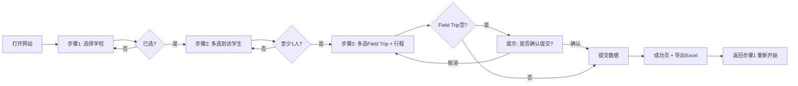

# 学校到访学生及 Field Trip 活动名单统计系统 - PRD

## 1. 产品概述

本系统是一个用于学校到访学生确认与 Field Trip 参与名单筛选的三步式数据采集与导出系统。采用"学校选择 → 到访确认 → 活动参与筛选"的递进式流程，实现从原始数据收集到结果导出的完整闭环。

- **目标用户**：学校组织方、活动组织方
- **核心价值**：用三步式交互极简完成到访与参与名单采集，零登录门槛，支持历史追溯与 Excel 导出

## 2. 核心特性

### 2.1 用户角色
| 角色 | 进入方式 | 核心权限 |
|------|----------|----------|
| 操作用户 | 公开访问（无需登录） | 选择学校、选择到访/Field Trip 学生、提交、导出 Excel |

### 2.2 功能模块
1. **首页/三步式流程页**：学校单选 → 到访学生多选 → Field Trip 学生多选 + 行程展示
2. **提交成功页**：展示提交摘要、记录编号、再来一次、导出 Excel
3. **历史记录/管理页**：浏览历史提交记录、导出全部数据

### 2.3 页面详情
| 页面名称 | 模块名称 | 功能描述 |
|---------|---------|---------|
| 步骤 1 - 选择学校 | 学校列表 | 单选 School A / B / C，未选不可下一步 |
| 步骤 2 - 确认到访学生 | 学生列表 | 多选该校学生，至少 1 名；支持搜索、上一步 |
| 步骤 3 - 活动参与筛选 | 学生筛选区 | 仅显示已选到访学生，可多选/全不选（推荐模式允许空） |
| 步骤 3 - 活动行程展示 | 行程信息卡 | 展示固定行程：日期、集合地点、出发时间、活动流程、午餐、返回时间、注意事项、联系方式 |
| 提交结果页 | 结果摘要 | 显示本次提交概要，提供"再提交一次"和"导出 Excel" |
| 历史记录页 | 记录表格 | 表格展示所有提交记录，含导出按钮 |

## 3. 核心流程

## 4. 用户界面设计

### 4.1 设计风格
- **主色调**：学术深蓝 `#0B2447` 为主色，搭配薄荷绿 `#19A7CE` 作为强调色
- **辅助色**：奶白 `#F8F4E1` 作为背景基调，灰阶文字 `#1A1A1A` / `#666` / `#999`
- **按钮风格**：圆角 12px，主按钮实心强调色、次按钮描边、移动端大点击区（48px+）
- **字体**：标题用 `Fraunces`（衬线、学术感），正文用 `Inter`（无衬线、清晰易读）
- **布局**：顶部进度条 + 中央卡片，左右对称；移动端单列堆叠
- **图标**：使用 `lucide-react` 图标库
- **特色元素**：纸张纹理背景、微妙阴影、行程信息卡采用"邮票打孔"风格的边框装饰

### 4.2 页面设计概述
| 页面名称 | 模块名称 | UI 元素 |
|---------|---------|---------|
| 步骤 1 - 学校选择 | 学校卡片 | 3 个大卡片显示学校名称 + 序号，单选高亮强调色边框 |
| 步骤 2 - 到访学生 | 学生列表 | 复选框 + 姓名；底部粘性"下一步"按钮 |
| 步骤 3 - Field Trip | 学生筛选 | 复用步骤 2 列表，仅显示已选学生；右侧行程卡 |
| 行程展示 | 行程卡 | 时间轴样式的活动流程、虚线分隔、关键时间点突出 |
| 提交成功 | 成功卡 | 大对勾动画、提交编号、再操作/导出按钮组 |
| 历史记录 | 数据表 | 简洁表格，按时间倒序，行操作查看详情 |

### 4.3 响应式设计
- **桌面优先**（≥1024px）：双列布局，左侧步骤内容，右侧行程卡（仅步骤 3）
- **平板**（768-1023px）：单列布局，行程卡移至底部
- **手机**（<768px）：单列堆叠，按钮占满宽度，行程卡折叠为可展开区域

## 5. 业务规则

- **Field Trip ⊆ 到访学生**：只能从已选到访学生中选 Field Trip
- **Field Trip 可为空**：推荐模式下允许空提交，确认提示
- **支持重复提交**：不限制同一学校重复提交
- **无登录**：公开访问
- **行程内容固定**：Field Trip 行程信息由后端硬编码，不在 UI 上编辑

## 6. 数据库与 API

- **表**：schools、students、submissions（详见技术架构）
- **API**：GET /api/schools、GET /api/schools/:id/students、POST /api/submissions、GET /api/submissions、GET /api/submissions/export
- **Excel 导出**：单 sheet，含学校、到访学生、Field Trip 学生、提交时间

## 7. MVP 范围

✅ 三步式流程
✅ 数据提交 + 持久化
✅ Excel 导出
✅ 基础校验
✅ 响应式（PC + 移动端）
✅ 历史记录浏览

## 8. 系统一句话定义

> 一个用于学校到访学生确认与 Field Trip 参与名单筛选的三步式数据采集与导出系统。
