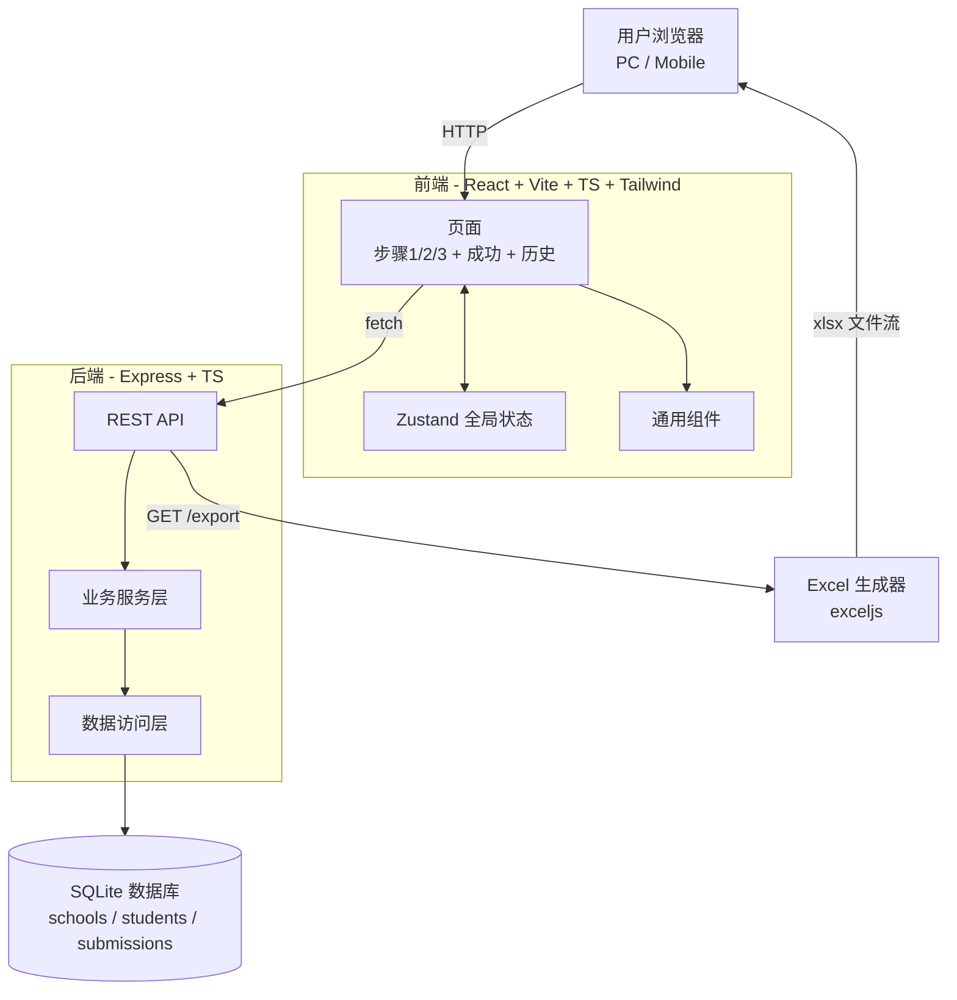
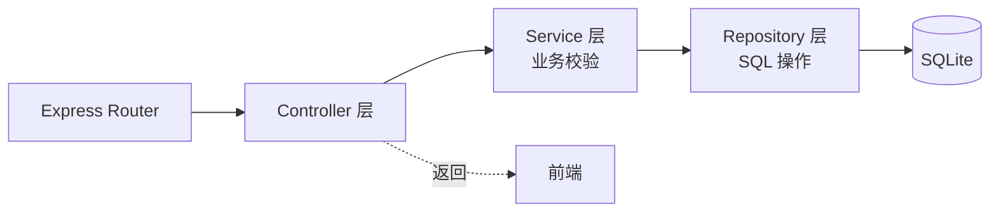
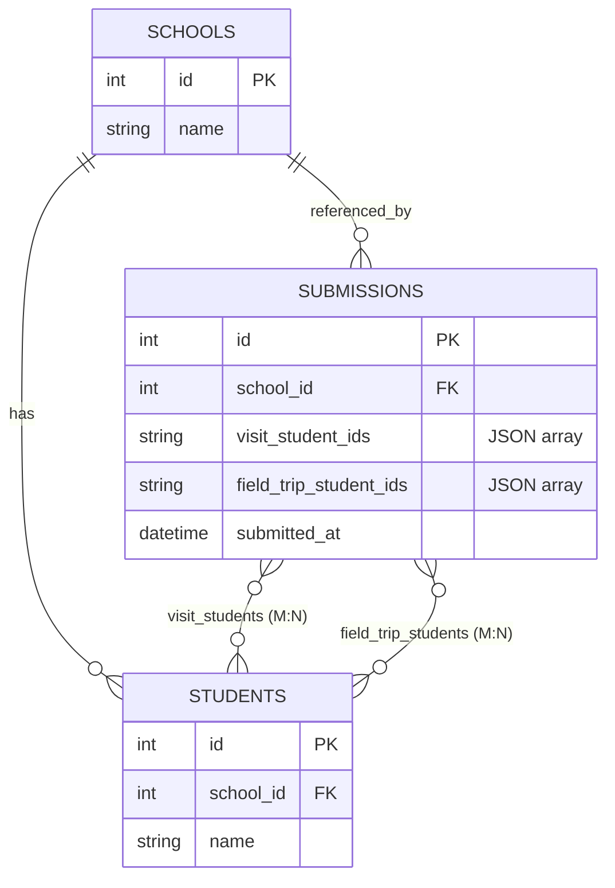

# 学校到访学生及 Field Trip 活动名单统计系统 - 技术架构

## 1. 架构设计



## 2. 技术栈

- **前端**：React@18 + TypeScript@5 + Vite@5 + TailwindCSS@3 + zustand@4 + react-router-dom@6 + lucide-react
- **后端**：Express@4 + TypeScript@5 + better-sqlite3（轻量、零运维） + exceljs（Excel 导出）
- **初始化工具**：`npm init vite-init@latest` (react-express-ts 模板)
- **数据库**：SQLite（本地文件 `data.db`，零部署成本；后期可平滑迁移到 PostgreSQL/MySQL）

## 3. 路由定义

| 路由 | 用途 |
|------|------|
| `/` | 入口重定向到 `/step/1` |
| `/step/1` | 步骤 1 - 选择学校 |
| `/step/2` | 步骤 2 - 确认到访学生 |
| `/step/3` | 步骤 3 - 活动参与筛选 + 行程展示 |
| `/success` | 提交成功页 |
| `/records` | 历史记录浏览页 |
| `/api/schools` | GET - 获取学校列表 |
| `/api/schools/:id/students` | GET - 获取某校学生 |
| `/api/submissions` | POST - 提交 / GET - 获取列表 |
| `/api/submissions/export` | GET - 导出 Excel |
| `/api/field-trip` | GET - 获取固定行程信息 |

## 4. API 定义

### 4.1 GET /api/schools
**响应**：
```typescript
type School = { id: number; name: string }
type Response = { schools: School[] }
```

### 4.2 GET /api/schools/:id/students
**响应**：
```typescript
type Student = { id: number; school_id: number; name: string }
type Response = { students: Student[] }
```

### 4.3 POST /api/submissions
**请求**：
```typescript
type Request = {
  school_id: number
  visit_student_ids: number[]
  field_trip_student_ids: number[]
}
```
**响应**：
```typescript
type Response = {
  submission_id: number
  school_id: number
  visit_student_ids: number[]
  field_trip_student_ids: number[]
  submitted_at: string  // ISO
}
```

### 4.4 GET /api/submissions
**响应**：
```typescript
type Submission = {
  id: number
  school_name: string
  visit_students: string
  field_trip_students: string
  submitted_at: string
}
```

### 4.5 GET /api/submissions/export
**响应**：xlsx 文件流，Content-Disposition: attachment

### 4.6 GET /api/field-trip
**响应**：固定行程对象（含活动名称、日期、集合地点、出发时间、活动流程、午餐、返回时间、注意事项、联系方式）

## 5. 服务端架构



- **Controller**：处理 HTTP 请求/响应，不含业务逻辑
- **Service**：业务规则（如 field_trip_student_ids 必须是 visit_student_ids 的子集）
- **Repository**：封装 SQL，提供 CRUD

## 6. 数据模型

### 6.1 ER 图



> 说明：为简化 MVP，submissions 表用 JSON 字符串存储学生 ID 数组；后期可拆为 `submission_students` 关联表。

### 6.2 DDL

```sql
CREATE TABLE schools (
  id INTEGER PRIMARY KEY AUTOINCREMENT,
  name TEXT NOT NULL UNIQUE
);

CREATE TABLE students (
  id INTEGER PRIMARY KEY AUTOINCREMENT,
  school_id INTEGER NOT NULL,
  name TEXT NOT NULL,
  FOREIGN KEY (school_id) REFERENCES schools(id)
);

CREATE TABLE submissions (
  id INTEGER PRIMARY KEY AUTOINCREMENT,
  school_id INTEGER NOT NULL,
  visit_student_ids TEXT NOT NULL,  -- JSON: [1,2,3]
  field_trip_student_ids TEXT NOT NULL DEFAULT '[]',
  submitted_at DATETIME DEFAULT CURRENT_TIMESTAMP,
  FOREIGN KEY (school_id) REFERENCES schools(id)
);
```

### 6.3 初始数据

```sql
INSERT INTO schools (name) VALUES ('School A'), ('School B'), ('School C');

INSERT INTO students (school_id, name) VALUES
  (1, 'Student A'), (1, 'Student B'), (1, 'Student C'), (1, 'Student D'),
  (2, 'Student E'), (2, 'Student F'), (2, 'Student G'),
  (3, 'Student H'), (3, 'Student I'), (3, 'Student J');
```

## 7. 目录结构

```
.
├── api/                          # 后端代码
│   ├── index.ts                  # Express 入口
│   ├── db.ts                     # SQLite 连接 + 初始化
│   ├── routes/
│   │   ├── schools.ts
│   │   ├── students.ts
│   │   ├── submissions.ts
│   │   └── field-trip.ts
│   ├── services/
│   │   └── submission.service.ts
│   ├── repositories/
│   │   ├── school.repo.ts
│   │   ├── student.repo.ts
│   │   └── submission.repo.ts
│   └── utils/
│       └── excel.ts              # Excel 导出
├── src/                          # 前端代码
│   ├── App.tsx
│   ├── main.tsx
│   ├── pages/
│   │   ├── Step1School.tsx
│   │   ├── Step2VisitStudents.tsx
│   │   ├── Step3FieldTrip.tsx
│   │   ├── Success.tsx
│   │   └── Records.tsx
│   ├── components/
│   │   ├── ProgressBar.tsx
│   │   ├── SchoolCard.tsx
│   │   ├── StudentCheckbox.tsx
│   │   ├── ItineraryCard.tsx
│   │   ├── Button.tsx
│   │   └── PageLayout.tsx
│   ├── store/
│   │   └── useFlowStore.ts       # zustand
│   ├── api/
│   │   └── client.ts             # fetch 封装
│   └── types/
│       └── index.ts
├── data.db                       # SQLite 数据库文件（运行时生成）
├── package.json
└── vite.config.ts
```

## 8. 关键设计决策

- **数据库选型**：SQLite 零运维，文件即数据库；适合 MVP；后期可换 PostgreSQL
- **前后端同构 TS**：共享类型在 `src/types/`
- **状态管理**：仅用 zustand 管理"当前流程"（学校、到访学生、Field Trip 学生），不引入 Redux
- **Excel 库**：exceljs 纯 JS、零原生依赖、跨平台
- **CORS**：开发期 vite proxy；生产同源
- **校验**：前端轻校验 + 后端强校验（field_trip ⊆ visit）
